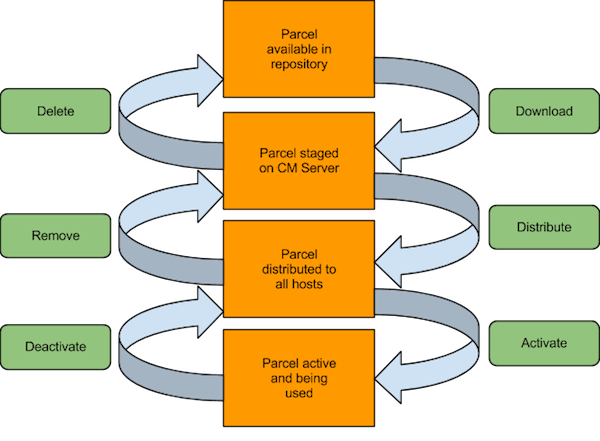

= Cloudera Manager & CDH Installation

* <<cm_cdh_installation, CM/CDH Installation>>
* <<cm_high_level_architecture, CM high-level architecture>>
* <<cm_features, CM features>>
* <<cloudera_s_supported_installation_paths, Cloudera's supported installation paths>>
* <<installation_steps_with_path_b, Installation Steps with Path B>>
* <<installing_cdh_with_parcels, Installing CDH with Parcels>>
* <<parcel_lifecycle, Parcel Lifecycle>>
* <<database_support, Database Support>>
* <<mysql_mariadb_replication_for_ha, MySQL/MariaDB Replication for HA>>
* <<cm_install_lab, CM Install Lab>>
* <<mysql_mariadb_installation_lab, MySQL/MariaDB Installation Lab>>
* <<cloudera_manager_install_lab, Cloudera Manager Install Lab>>
* <<final_points, Final Points>>

[[cm_cdh_installation]]
== CM/CDH Installation

* We use Cloudera Manager in several capacities:
** To deploy EDH, Kafka, or Key Trustee clusters
** To monitor the health of managed nodes and Hadoop services
** To monitor and modify property settings
** Expedite complex tasks, such as:
*** Upgrading Cloudera Manager server and agent software
*** Configuring HDFS NameNode HA
*** Integrating Kerberos & LDAP services
*** Enabling HDFS Encryption

[[cm_high_level_architecture]]
== CM high-level architecture

image::png/cm_arch.png[width=600]

[[cm_features]]
== CM features

* The Cloudera Manager server provides
** An administrative console
** Links to Hadoop package and parcel repositories
** Management Services: reports, logging, auditing
*** A database server is needed to support some of these functions
** Host and Service monitoring

[[cloudera_s_supported_installation_paths]]
== Cloudera's supported installation paths

* link:http://www.cloudera.com/documentation/enterprise/latest/topics/cm_ig_non_production.html[Installing a PoC cluster] (f.k.a. "Path A" installation)
** Useful for short-term, throwaway projects
** Use an embedded PostgreSQL server
* link:http://www.cloudera.com/documentation/enterprise/latest/topics/install_cm_cdh.html[Manual setup for CM and its database] (f.k.a. "Path B" installation)
** Any cluster that will stand for more than 3-6 months
** Supports Oracle, MySQL/MariaDB, and PostgreSQL servers
** Uses Linux packages or link:http://www.cloudera.com/documentation/enterprise/latest/topics/cm_ig_parcels.html[CM parcels]
* link:https://www.cloudera.com/documentation/enterprise/5-15-x/topics/cm_ig_install_path_c.html[Tarball installation] (f.k.a. "Path C" installation)
** DIY-oriented
** Useful for development work, other preferred deployment tools (Chef, Puppet)
** **Deprecated in C6!**

[[installation_steps_with_path_b]]
== Installation Steps with Path B

* Verifying the platform can reveal many potential bugs
* Review key hardware, OS, disk, and network/kernel settings
* Install a supported Oracle JDK
* Install and configure a link:https://www.cloudera.com/documentation/enterprise/latest/topics/cm_ig_installing_configuring_dbs.html[database server]
* Create databases & grant CDH users access to them
** For MySQL/MariaDB or Oracle, you need a JDBC connector
* Once CM is up and running, it automates
** Distributing agent software
** Distributing CDH software
** Deploying and activating CDH services

[[installing_cdh_with_parcels]]
== Installing CDH with Parcels

Parcels are link:https://github.com/cloudera/cm_ext/wiki/Parcels:-What-and-Why%3F[CM-specific code blobs]

* Core CDH components in one distribution
** CM can track a list of add-on parcel locations
** Parcels are served over http
* Easier to manage than per-product Linux packages
** Default installation path is `/opt/cloudera`
* Most CDH components bind to CM through a link:https://github.com/cloudera/cm_ext/wiki/CSD-Overview[custom service descriptor]
* A parcel is just a tarball with its own link:https://github.com/cloudera/cm_ext/wiki/Building-a-parcel[manifest and layout]
** Content list: `meta/parcel.json`
** CM verifies a parcel's signature via a `manifest.json`
*** Ignores parcel if the signature doesn't match
*** `manifest.json` is only stored on the repo server
*** Each parcel file is link:http://archive.cloudera.com/cdh5/parcels/5/[specific to a Linux distribution and major release]

[[parcel_lifecycle]]
== Parcel Lifecycle

_Source: link:https://blog.cloudera.com/blog/2013/05/faq-understanding-the-parcel-binary-distribution-format/[Blog: FAQ: Understanding the Parcel Binary Distribution Format]_

* link:https://www.cloudera.com/documentation/enterprise/latest/topics/cm_ig_parcels.html[How to manage parcels]

* Lifecycle actions
** Download
** Distribute
** Activate/deactivate
** Remove
** Delete
* The path `/opt/cloudera/parcels/CDH` will point to the active CDH version

[[database_support]]
== link:http://www.cloudera.com/content/cloudera/en/documentation/core/latest/topics/cm_ig_installing_configuring_dbs.html[Database Support]
* Management Services
** Reports Manager
** Navigator Audit & Metadata Servers
** The Host Monitor and Service Monitor use a file-based store
*** link:https://github.com/google/leveldb[LevelDB] implementation
* CDH services that need a database server
** link:https://www.cloudera.com/documentation/enterprise/latest/topics/hive.html#metastore[Hive Metastore]
** link:https://www.cloudera.com/documentation/enterprise/latest/topics/sg_sentry_overview.html[Sentry service]
** link:http://www.cloudera.com/content/cloudera/en/documentation/core/latest/topics/cm_mc_oozie_service.html#cmig_topic_14_unique_1[Oozie]
** link:http://www.cloudera.com/content/cloudera/en/documentation/core/latest/topics/cm_mc_hue_service.html#cmig_topic_15_unique_1[Hue]
** link:https://www.cloudera.com/documentation/enterprise/latest/topics/install_sqoop_ext_db.html[Sqoop Server], a.k.a. Sqoop2 (not discussed)

[[mysql_mariadb_replication_for_ha]]
== MySQL/MariaDB Replication for HA

* A complete HA solution for Cloudera Manager is complex and expensive
* link:https://www.cloudera.com/documentation/enterprise/latest/topics/admin_cm_ha_overview.html[Public documentation is here]
* The full solution requires
** A load balancer between CM servers (one active, one passive)
** Redundant network-accessible storage
** Redundant database servers
** Heartbeat Demon software (Cloudera-supported only)
* For today's lab, we'll just implement link:http://dev.mysql.com/doc/refman/5.5/en/replication-howto.html[MySQL]/link:https://mariadb.com/kb/en/mariadb/setting-up-replication/[MariaDB]

[[cm_install_lab]]
== CM Install Lab

=== *Before* You Start

* link:../README.adoc[Follow instructions here] and link:../README_GitHub.adoc[here] if you haven't already
* Remember to submit text-based work in AsciiDoc and screenshots as PNG files
** Use code formatting (``...``) at a minimum
* Create an Issue in your repo called `Installation Lab`
** Add it to the `Labs` milestone
** Assign the label `started`
* Use the issue to note your lab progress
** Add a comment when you have finished a lab section
** Add a comment if you run into a puzzling error or other blocker
** If you also fix it a problem, comment on the cause and solution

=== Prepare your instances

* For AWS, create five `m3.xlarge` nodes
** Do not use spot instances
** **Set your volume space to the maximum free amount**
*** The AWS default per instance (8 GB) is not enough.
* For GCE, use `n1-highmen-2` nodes
** Do not use preemptible instances
* Make sure the AMI you choose is a Cloudera-supported OS
** link:https://www.cloudera.com/documentation/enterprise/release-notes/topics/rn_consolidated_pcm.html#concept_jpd_hpz_jdb[Check the supported platforms] for the CM/CDH version you are using
* Use one instance to host Cloudera Manager server and edge/client-facing services
** This includes Hue and Apache Oozie

=== System Configuration Checks

Using the steps below, verify that all instances are ready. You must modify
them when necessary, which includes installing missing packages and changing
kernel tunables or other system settings.

You only need to show this work for one of the instances, but you
will run into trouble later on if you don't complete this work on
all of them.

Put your work in `labs/1_preinstall.adoc`. Make sure to includes the
command that produces each output.

. Check `vm.swappiness` on all your nodes
** Set the value to `1` if necessary
. Show the mount attributes of your volume(s)
. If you have `ext`-based volumes, list the reserve space setting
** XFS volumes do not support reserve space
. Disable transparent hugepage support
. List your network interface configuration
. Show that forward and reverse host lookups are correctly resolved
** For `/etc/hosts`, use `getent`
** For DNS, use `nslookup`
. Show the `nscd` service is running
. Show the `ntpd` service is running 

**NOTE**: For this lab, stick to the checks above. When performing pre-reqs check for customers, though, use the link:https://cloudera.box.com/s/b5vk5ltu9t2inotc0pv32hekgns8e9k2[comprehensive list compiled by the FCE folks].

[[mysql_mariadb_installation_lab]]
== MySQL/MariaDB Installation Lab

=== Configure MySQL with a replica server

Choose one of these plans to follow:

* You can use the steps
link:http://www.cloudera.com/documentation/enterprise/latest/topics/install_cm_mariadb.html[documented here for
MariaDB]
or link:http://www.cloudera.com/documentation/enterprise/latest/topics/cm_ig_mysql.html[here for MySQL]. 
* The steps below are MySQL-specific.
**  If you are using RHEL/CentOS 7.x, **use MariaDB**.

=== MySQL installation - Plan Two Detail

. Download and implement the link:http://dev.mysql.com/downloads/repo/yum/[official MySQL repo]
** Enable the repo to install MySQL 5.5
** Install the `mysql` package on all nodes
** Install `mysql-server` on the server and replica nodes
** Download and copy link:https://dev.mysql.com/doc/connector-j/5.1/en/connector-j-binary-installation.html[the JDBC connector] to all nodes.
. You should not need to build a `/etc/my.cnf` file to start your MySQL server
** You will have to modify it to support replication. Check MySQL documentation.
. Start the `mysqld` service.
. Use `/usr/bin/mysql_secure_installation` to: 
.. Set password protection for the server 
.. Revoke permissions for anonymous users 
.. Permit remote privileged login 
.. Remove test databases 
.. Refresh privileges in memory 
.. Refreshes the `mysqld` service
. On the master MySQL node, grant replication privileges for your replica node: 
.. Log in with `mysql -u ... -p`  
.. Note the FQDN of your replica host. 
.. `mysql> **GRANT REPLICATION SLAVE ON \*.\* TO '*user*'@'*FQDN*' IDENTIFIED BY '*password*';**` 
.. `mysql> **SET GLOBAL binlog_format = 'ROW';** ` 
.. `mysql> **FLUSH TABLES WITH READ LOCK;`**
. In a second terminal session, log into the MySQL master and show its  status: 
.. `mysql> **SHOW MASTER STATUS;**` 
.. Make note of the file name and byte offset. The replica needs this info to sync to the master. 
.. Logout of the second session; remove the lock on the first with `mysql> **UNLOCK TABLES;**`
. Login to the replica server and configure a connection to the master: 
+
[source]
----
mysql> **CHANGE MASTER TO**  **MASTER_HOST='*master host*',**  **MASTER_USER='*replica user*',**  **MASTER_PASSWORD='*replica password*',**  **MASTER_LOG_FILE='*master file name*',**  **MASTER_LOG_POS=*master file offset*;**
----
. Initiate slave operations on the replica 
.. `mysql> **START SLAVE;**` 
.. `mysql> **SHOW SLAVE STATUS \G**` 
.. If successful, the `Slave_IO_State` field will read `Waiting for master to send event` 
.. Once successful, capture this output and store it in `labs/2_replica_working.adoc` 
.. Review your log (`/var/log/mysqld.log`) for errors. If stuck, consult with a colleague or instructor

[[cloudera_manager_install_lab]]
== Cloudera Manager Install Lab

=== Path B install using CM 5.15.x

link:https://www.cloudera.com/documentation/enterprise/5-15-x/topics/install_cm_cdh.html[The full rundown is here].
You will have to modify your package repo to get the right release.
The default repo download always points to the latest version.

Use the documentation to complete the following objectives:

* Install a supported Oracle JDK on your first node
* Install a supported JDBC connector on all nodes
* Create the databases and access grants you will need
* Configure Cloudera Manager to connect to the database
* Start your Cloudera Manager server -- debug as necessary
* Do not continue until you can browse your CM instance at port 7180

=== Install a cluster and deploy CDH

Adhere to the following requirements while creating your cluster:

* Do not use Single User Mode. Do not. Don't do it.
* Ignore any steps in the CM wizard that are marked `(Optional)`
* Install the Data Hub Edition
* Install CDH using parcels
* **Rename your cluster** using your GitHub account name
* Deploy **only** the `Core set` of CDH services.
* Deploy **three** ZooKeeper instances.
** CM does not tell you to do this but complains if you don't
* Once you've renamed your cluster and services are green healthy, take a screenshot of the CM home page
** Name this file `labs/3_cm_installed.png`.
* Label your Issue 'review' unless you go on to the Bonus Lab.

=== Bonus Lab: Create a local parcel repo (manual)

* Click the parcel icon in CM's navigation bar
** Note the `Remote Parcel Repository URL` values
* Follow the link:http://www.cloudera.com/documentation/enterprise/latest/topics/cm_ig_create_local_parcel_repo.html[documentation] to configure a local repo
* Add the local URL to Cloudera Manager's parcel configuration
* Show the parcel repo registers in CM as available
* Label your Issue `review`

=== For Further Reading: Auto-deployment

* If you are interested to learn about automating installs:
** Fork/clone link:https://github.com/justinhayes/cm_api/tree/master/python/examples/auto-deploy[Justin Hayes' auto-deploy project]
* No submissions are needed; you can browse this repository as you wish.

[[final_points]]
== Final Points

* See the graphic of install paths in the `tools/` subdirectory.
* You can review a full CM HA link:http://www.cloudera.com/content/cloudera/en/documentation/core/latest/topics/admin_cm_ha_overview.html[configuration here]
* Note that CDH operation does not depend on Cloudera Manager's state
* CM supports a REST API
** Each API version is a superset of all prior versions
** Try `http://_your_cm_host_:7180/api/version` in your browser
** The CM API link:http://cloudera.github.io/cm_api/[is documented here]
