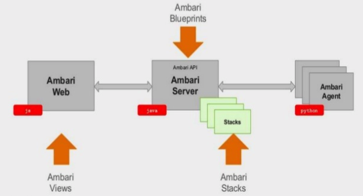

= Cloudera Manager & HDP Installation

* <<ambari_hdp_installation, Ambari/HDP Installation>>
* <<ambari_high_level_architecture, Ambari high-level architecture>>
* <<ambari_features, Ambari features>>
* <<ambari_installation_steps, Ambari's installation steps>>
* <<stacks_and_mgmt_packs, Stacks and Management Packs>>
* <<ambari_install_lab, Ambari Install Lab>>

[[ambari_hdp_installation]]
== Ambari/HDP Installation

* Ambari is a centralized installation, configuration and management tool
* Supports Hortonworks products, as the ones listed below, and is *extensible*
** HDP - Hadoop (HDFS, YARN, etc)
** HDF - Data flow and streaming components (Kafka and Nifi)
** Metron - Cyber Security solution
* Enables repeatable, automated cluster creation with Ambari Blueprints
* Centralized Security Setup. Helps automate the setup and configuration of advanced cluster security capabilities such as Kerberos and Apache Ranger.
* Full Visibility into Cluster Health
** Configures predefined alerts — based on operational best practices — for cluster monitoring
** Captures and visualizes critical operational metrics — using Grafana — for analysis and troubleshooting
** Integrated with Cloudera SmartSense for proactive issue prevention and resolution.
* Both Ambari and HDP are deployed though rpm / dpkg. Ensure you link:https://docs.hortonworks.com/HDPDocuments/Ambari-2.7.3.0/bk_ambari-installation/content/using_a_local_redHat_satellite_spacewalk_repo.html[create a local RedHat Satellite/Spacewalk server] if no internet access is available

[[ambari_high_level_architecture]]
== Ambari high-level architecture

[[ambari_features]]
== Ambari features

* Ambari provides
** An administrative console
** Blueprints - automation and sharing best practices
** Customizable Stacks
** Customizable Views
** Full Visibility into Cluster Health
*** Configures predefined alerts — based on operational best practices — for cluster monitoring
*** Captures and visualizes critical operational metrics — using Grafana — for analysis and troubleshooting
*** Integrated with Cloudera SmartSense for proactive issue prevention and resolution.
*** Host and Service monitoring

[[ambari_installation_steps]]
== Ambari's installation steps

* Verifying the platform can reveal many potential bugs
** Review key hardware, OS, disk, and network/kernel settings
* Install a supported version of *OpenJDK* (see link:https://supportmatrix.hortonworks.com/[support matrix])
* Install and configure a database server
** Supports Oracle, MySQL/MariaDB, and PostgreSQL servers
** Check link:https://supportmatrix.hortonworks.com/[support matrix] for exact versions
** *DO NOT* use the embedded PostgreSQL server option. This is only for throw-away clusters.
* Create databases and grant users access to them
** For MySQL/MariaDB or Oracle, you will need to install a JDBC connector
* Once Ambari is up and running, it automates
** Distributing agent software
** Distributing HDP software
** Deploying and activating HDP services

[[stacks_and_mgmt_packs]]
== Stacks and Management Packs

* Stacks
** Customizable software stack used by your cluster
** Customization is a manual process
** Originally tied to the Ambari release cycle

* Management Packs
** Decouple stack releases from the Ambari core release
** Automate the addition of extra services and stacks
** Tarball with some metadata

[[ambari_install_lab]]
== Ambari Install Lab

In this lab you will complete the installation of the following:

* Ambari 2.7
* HDP 3.0

By the end of the lab you should have a running Ambari server and Hadoop cluster installed as per Cloudera's best practices.

=== Prepare your instances

* For AWS, create five `m3.xlarge` nodes
** Do not use spot instances
** **Set your volume space to the maximum free amount**
*** The AWS default per instance (8 GB) is not enough.
* For GCE, use `n1-highmen-2` nodes
** Do not use preemptible instances
* Make sure the AMI you choose is a Cloudera-supported OS
** link:https://www.cloudera.com/documentation/enterprise/release-notes/topics/rn_consolidated_pcm.html#concept_jpd_hpz_jdb[Check the supported platforms] for the Ambari/HDP version you are using
* Use one instance to host Ambari server and edge/client-facing services

=== System Configuration Checks

Using the steps below, verify that all instances are ready. You must modify
them when necessary, which includes installing missing packages and changing
kernel tunables or other system settings.

You only need to show this work for one of the instances, but you
will run into trouble later on if you don't complete this work on
all of them.

Put your work in `labs/1_preinstall.adoc`. Make sure to include the
command that produces each output.

. Ensure that the link:https://docs.hortonworks.com/HDPDocuments/Ambari-2.7.3.0/bk_ambari-installation/content/ch_Getting_Ready.html[minimum requirements] for the installation are met
** Check https://supportmatrix.hortonworks.com/
. Check `vm.swappiness` on all your nodes
** Set the value to `1` if necessary
. Disable transparent hugepage support
. Disable IPv6
** List your network interface configuration showing that only IPv4 is enabled
. Show that forward and reverse host lookups are correctly resolved
** For `/etc/hosts`, use `getent`
** For DNS, use `nslookup`
. Show the `nscd` service is running
. Show the `ntpd` service is running
. Show the SElinux status

**NOTE**: For this lab, stick to the checks above. When performing pre-reqs check for customers, though, use the following pre-requisite checklist compiled by the FCE folks:

* link:https://cloudera.box.com/s/b5vk5ltu9t2inotc0pv32hekgns8e9k2[FCE Cluster prerequisite checklist].

=== Choosing passwords

A quick note about passwords: Ambari requires and enforces strong passwords for some services. If the passwords are not strong Ambari will refuse to continue the installation.

Rather than cherry-picking the passwords that need to be strong, get into the habit of always using strong passwords to avoid issues and to make your environment more secure.

Use passwords that satisfy the following requirements:

* At least 10 characters long
* Contain at least one lowercase character
* Contain at least one uppercase character
* Contain at least one digit
* Contain at least one special character

=== Install and configure a MariaDB instance

In this lab you will setup MariaDB *without* HA. HA configuration was already practice in a previous lab so we'll skip HA configuration now for the sake of time.

* Check Ambari and HDP compatibility with MariaDB versions and ensure an appropriate version is installed
* Follow the appropriate instructions:
** link:https://docs.hortonworks.com/HDPDocuments/Ambari-2.7.3.0/administering-ambari/content/amb_example_install_mysql-mariadb_for_multiple_components.html[MariaDB]
* Service-specific instructions:
** link:https://docs.hortonworks.com/HDPDocuments/Ambari-2.7.3.0/bk_ambari-installation/content/configuring_mysql_for_ranger.html[Ranger]
** link:https://docs.hortonworks.com/HDPDocuments/Ambari-2.7.3.0/administering-ambari/content/amb_using_hive_with_mysql.html[Hive]
** link:https://docs.hortonworks.com/HDPDocuments/Ambari-2.7.3.0/administering-ambari/content/amb_using_oozie_with_mysql.html[Oozie]

=== Environment preparation

Put your work in `labs/2_env_prep.adoc`. Make sure to include the
command that produces each output.

* Complete *ALL* the environment link:https://docs.hortonworks.com/HDPDocuments/Ambari-2.7.3.0/bk_ambari-installation/content/prepare_the_environment.html[preparation steps] in the Hortonworks website
** *Skip* the creation of service user accounts
* Show the MariaDB version
* Connect to your database instance and show the results of the `SHOW DATABASES` command
* Show the status of SELinux with the following commands:
** `selinuxenabled; echo $?`
** `cat /etc/selinux/config`

=== Ambari Installation

Use the link:https://docs.hortonworks.com/HDPDocuments/Ambari-2.7.3.0/bk_ambari-installation/content/ch_Installing_Ambari.html[documentation] to complete the following objectives:

* Install a supported JDBC connector on *all nodes*
* Download the Ambari Repository
* Install the Ambari Server
* link:https://docs.hortonworks.com/HDPDocuments/Ambari-2.7.3.0/administering-ambari/content/amb_using_ambari_with_mysql_or_mariadb.html[Configure Ambari to use MySQL]
* Set Up the Ambari Server
** Choose `y` for the "*Enter advanced database configuration?*   " question
* link:https://docs.hortonworks.com/HDPDocuments/Ambari-2.7.3.0/bk_ambari-installation/content/hdp_start_the_ambari_server.html[Start] your Ambari server -- troubleshoot as necessary
* Do not continue until you can browse your Ambari instance at port 8080

=== Install a cluster and deploy HDP

Adhere to the requirements below while creating your cluster. Detailed instructions are available link:https://docs.hortonworks.com/HDPDocuments/Ambari-2.7.3.0/bk_ambari-installation/content/ch_Deploy_and_Configure_a_HDP_Cluster.html[here]

* **Name your cluster** using your GitHub account name
* Choose the latest HDP to install version
* Choose the "*Use Public Repository*" option
* Do *not* include the Ambari host in the list of *Target Hosts*
* Deploy **only** the following HDP services:
** YARN, Tez, Hive, HBase, Sqoop, Oozie, Zookeeper
** Infra Solr, Ambari Metrics, Atlas, Kafka, Log Stash
** Ranger, Spark2, Zeppelin Notebook
* Assign Slaves and Clients to *hosts 3, 4 and 5*
* Once your cluster is deployed and services are healthy (green), take a screenshot of the Ambari home page
** Save the screenshot as file `labs/3_ambari_installed.png`.
* Save the cluster Blueprint as file `labs/4_cluster_blueprint.json`.
* Label your Issue `review` unless you go on to the Bonus Lab.

=== Install HDF and the NiFi service

In this lab you will Install HDF using a Management Pack. Follow the instructions for *link:https://docs.hortonworks.com/HDPDocuments/HDF3/HDF-3.4.0/installing-hdf-on-hdp/content/hdf-upgrade-ambari-and-hdp.html[Installing HDF Services on an Existing HDP Cluster]*.

* Before you begin, on the Ambari UI, go to *Stacks and Versions -> STACKS*
** Save a screenshot as file `labs/5_stack_before_mpack.png`.
* Review the link:https://docs.hortonworks.com/HDPDocuments/HDF3/HDF-3.4.0/release-notes/content/hortonworks-dataflow-release-notes.html[HDF Release Notes] and download the latest version of the Management Pack (mpack) tarball.
* Install the Management Pack using the `ambari-server install-mpack` command
* Restart the Ambari Server service
* On the Ambari UI, go again to *Stacks and Versions -> STACKS*
** Save a screenshot as file `labs/6_stack_after_mpack.png`, identifying the differences from the previous one.
** What's the version of the _NiFi Registry_ service?
* *If the version of the _NiFi Registry_ service is `0.4.0` or greater*, it already supports MySQL/MariaDB as a backend database. If this is your case, run the following step:
** link:https://nifi.apache.org/docs/nifi-registry-docs/html/administration-guide.html#mysql[Create a database] for the NiFi Registry service
* Add the *NiFi* and *Nifi Registry* services to your cluster
** When prompted to assign slaves to hosts, *UNSELECT* the _NiFi Certificate Authority_
** If the version of the _NiFi Registry_ service is less than `0.4.0`, use the default H2 database.
** Otherwise, configure the service to link:https://nifi.apache.org/docs/nifi-registry-docs/html/administration-guide.html#mysql[use the MySQL database] created above.
* Start the *NiFi* and *Nifi Registry* services if not already started
* Open the *NiFi* UI
** Add a _label_ to the NiFi canvas and type your username
** Save a screenshot as file `labs/7_nifi.png`.
* Open the *NiFi Registry* UI
** Create a bucket with your username
** Save a screenshot showing the bucket as file `labs/8_nifi_registry.png`.
* Label your Issue `review`

=== Bonus Lab: Using Ambari REST API

* Explore the Ambari REST API using the Ambari Swagger page:
** `<ambari_url>/api-docs`
** Additional resources:
*** link:https://github.com/apache/ambari/blob/trunk/ambari-server/docs/api/v1/index.md[Ambari API Reference v1]
*** link:https://cwiki.apache.org/confluence/display/AMBARI/API+usage+scenarios%2C+troubleshooting%2C+and+other+FAQs[Ambari Wiki - API usage scenarios, troubleshooting, and other FAQs]
*** link:https://cwiki.apache.org/confluence/display/AMBARI/Running+Service+Checks[Ambari Wiki - Running service checks]
* Get the details of the HDFS service using the Swagger UI
** Save the screenshot as file `labs/9_hdfs_svc_details.png`.
* Using `curl`, submit a request to run the Service Check for the YARN service
** Save the command line and the payload data for your request in the file `labs/10_curl_svc_check.txt`.
* Using `curl`, verify that the request execution completed successfully
** Save the command line and command ouput in the file `labs/11_curl_svc_check_results.txt`.
* Using either `curl` or the Ambari console, find out the checks executed by the YARN Service Check
** Save the check commands in the file `labs/12_svc_check_commands.txt`.
* Label your Issue `review`
