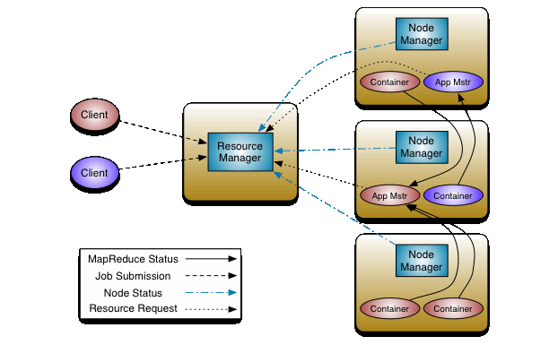

= Resource Management & YARN

* <<review_the_mapreduce_service_mrv1_, Review: The MapReduce service (MRv1)>>
* <<yarn, YARN>>
* <<resource_management_for_the_cluster, Resource Management for the Cluster>>
* <<service_level_isolation_cgroups_, Service-level Isolation (cgroups)>>
* <<regulating_yarn_and_impala_demands, Regulating YARN and Impala demands>>
* <<more_on_admission_control, More on Admission Control>>
* <<a_word_on_dynamic_prioritization, A Word on Dynamic Prioritization>>
* <<current_practices_for_yarn_impala, Current Practices for YARN & Impala>>
* <<yarn_rm_lab, YARN/RM Lab>>

[[review_the_mapreduce_service_mrv1_]]
== Review: The MapReduce service (MRv1)

* JobTracker responsibilities
** Schedule jobs
** Monitor TaskTracker processes
** Update jobs status
** Cache and serve recent job history
* TaskTracker responsbilities
** Provide a pre-determined number of mapper and reducer slots
** Slots are child JVM processes
** Slot count per node is based on cores, "spindles", and _workload estimate_

[[yarn]]
== YARN

=== YARN/MRv2: Design

_Source: link:http://hadoop.apache.org/docs/current/hadoop-yarn/hadoop-yarn-site/YARN.html[Apache Hadoop YARN documentation]_

=== YARN (MRv2 included): Roles

* Resource Manager
** Supervises NodeManagers, schedules jobs
** Limits resource consumption across all running jobs
** UI on port 8088
* Node Manager
** Launches/manages containers
** Updates the Resource Manager
** UI on port 8042
* Container
** Execution context for a job
** Unlike a slot, can be sized per job
* Application Master
** Control one job's tasks and resource requirements
*** MapReduce: `org.apache.hadoop.mapreduce.v2.app.MRAppMaster`
*** Spark: `org.apache.spark.deploy.yarn.applicationmaster`
* JobHistory Server (built in, MapReduce only)
** UI port on 19888
** Spark has its own (UI port on 18088)

=== YARN Job Control

. Client submits a job
. RM identifies the appropriate AM and loads it
. AM requests data blocks via the NameNode
. AM requests container/executor resources via the RM
. RM reports available resources
. AM asks NodeManagers for resources using RM access token
. AM releases each container upon task completion, notifies the RM
. RM updates the Job History server

=== YARN vs. MRv1 or Spark Standalone

* Better resource scalability and utilization
** Especially for very large clusters
* Better performance for certain, well-known use cases
** E.g., a large multitenant cluster running many small jobs
** Isolating resources for multiple engines
** Centralized logging
* The Original Vision: one RM to cover all processing requirements
** RM HA is available
* Multiple mutli-tenant models possible
** Node labeling: assigning specific tasks to specific hardware
** Custom, pluggable classifiers for auditing and reporting

[[resource_management_for_the_cluster]]
== Resource Management for the Cluster

Managing resources cluster-wide is divided into three areas:

. <<rm_service_isolation, Service-level isolation>>
** Sets minimum resources for all cluster services, including YARN
** E.g., HDFS, HBase, Impala, Search, MRv1
. <<admission_control, Admission Control for Impala>>
** Resource priority based on request, service type
** Prevent memory overruns
. link:https://www.cloudera.com/documentation/enterprise/latest/topics/cm_mc_resource_pools.html[Dynamic Resource Pools] for YARN
** Weight resources among pools by scheduling rules

[[rm_service_isolation]]
== Service-level Isolation (cgroups)

* Assures each service a percentage of cluster resources
** Enforced under contention
* Cloudera Manager implements this through link:https://www.cloudera.com/documentation/enterprise/latest/topics/cm_mc_cgroups.html[Linux Control Groups]
** Resources controls are limited to Linux support
** Could support CPU, memory, disk I/O, and network limits, if available
** `Cluster > ClusterName > Static Service Pools`

[[regulating_yarn_and_impala_demands]]
== Regulating YARN and Impala demands

* link:https://www.cloudera.com/documentation/enterprise/latest/topics/impala_admission.html[Admission control for Impala queries]
** On by default for Impala 1.3 and later
* Cloudera Manager supports link:https://www.cloudera.com/documentation/enterprise/latest/topics/cm_mc_resource_pools.html[Dynamic Resource Pools] for Impala as well
** A _configuration set_ is used to define a client group (e.g., prod, mktg, batch, queries)
** _Scheduling rules_ inform the configuration set's policy
** Pool resources are determined by user permissions, query count, queue size, memory demand
* See `Cluster > ClusterName > Dynamic Resource Pools`

[[admission_control]]
== Impala Admission Control

* Impala and YARN use the same pool definitions
* Three decisions: execute, queue, or reject a query
* Decision factors:
** Currently running queries
** Memory available
** Current queue length
* Each local `impalad` decides how to act
** To compensate for stale data, admission control is soft
* Impala favors running more tasks over preserving headroom
** Work to improve this decision-making is ongoing
* Never use Llama. It's not supported

[[dynamic_prioritization]]
== A Word on Dynamic Prioritization

* *L*ow-*L*atency *A*pplication *MA*ster (link:http://cloudera.github.io/llama/[LLAMA]) for Impala
** Released with CDH5 as a beta component
** Concept: run all Impala queries through one AM
*** Interaction with the RM is not NRT-friendly
** Project dropped after C5.5
* The objectives are the same
** Balance low-latency queries with batch processing
** Find more efficient means to dispatch multiple scheduler queues
** Devise opportunistic processing schemes for more efficient utilization
** Improve resource estimation (e.g., Impala's `COMPUTE STATS`)

[[current_practices_for_yarn_impala]]
== Current Practices for YARN & Impala

* Look in every minor release for best practice updates
** Set and monitor Static Resource Pools to limit hogging and prevent starvation
** Use Admission Control with Impala to cap number of concurrent queries
* Notify customers that LLAMA is done
** No replacement on the roadmap

[[yarn_rm_lab]]
== YARN/RM Lab

=== YARN/RM Lab: Review the Tuning Guides

In this lab we will use the Cloudera's link:http://www.cloudera.com/documentation/enterprise/latest/topics/cdh_ig_yarn_tuning.html[public YARN
guide]. Please download the spreadsheet referred in that document. We'll use it in this lab.

Suppose you have a cluster with 20 worker nodes, each of which has:

* 28 vcores
* 128 GiB RAM
* 12 independent disks available to the DataNode

Consider the following facts:

* Half of the workload running on the cluster is Hive on MR
* The other are assorted Spark jobs operating on large data sets

Do the following:

. Plug the hardware numbers into spreadsheet
. Change the percentage of reserved memory for the OS to 10%
. Set Impala's CPU/memory demand to the minimum recommended value
. Assume HBase and Solr will not be deployed
. Determine an appropriate workload factor for an ingestion-heavy use case
. Capture your finished worksheet as a screenshot to `04-resources/labs/1_YarnCalcs.png`

=== YARN/RM Lab: Static Service Pools

* Navigate to the Static Service Pools page
** Capture the Status and Service Usage sidebars to `04-resources/labs/2_service_usage.png`
* On the Configuration tab, allocate 20% to HDFS and 80% to YARN
** If you installed other services such as HBase or Impala, delete them first
** Complete the wizard and restart your cluster
* Confirm the settings after the restart

=== YARN/RM Lab: Tuning for YARN

* In this lab, experiment with job parameters to determine which
version of a common job runs the fastest.

* Review the file `04-resources/tools/YARNtest.sh`
* Run this script from your edge node
** Check it first: there may be 1-2 things wrong with it
** Modify the script to echo the parameter values for each run
** Incorporate the `time` command to report how long each job takes to finish
** Change the mapper, reducer, and container memory parameters to emulate different resource demands
* Run the script: your most demanding job should try to max out the cluster
* Add the following to your `04-resources/labs` directory
** Your modified version of the script as `3_YARNtest.sh.adoc`
** The parameters used and times of your slowest and fastest runs in `4_YARN_results.adoc`
* In CM, navigate to YARN Applications
** Select the `Charts` tab and take a screenshot.
** Save it to `04-resources/labs/5_YARN_Charts.png`
* Label your Issue `review` when the lab is finished.

== Appendix: YARN parameters

You can set YARN properties to control the allocations of memory
and vcores per working node. Settings for the NodeManager govern
per-node limits, while settings for the ResourceManager (scheduler)
govern limits for any container request.

[cols=3*,options="header"]
|===
|YARN property
|Basic description
|How it affects MR or Spark jobs

|`yarn.nodemanager.resource.memory-mb`
|Total RAM available for containers (MB)
|Max RAM per node available for MR tasks or Spark executors

|`yarn.scheduler.maximum-allocation-mb`
|Per-container allocation ceiling (MB)
|The most RAM any container can get; requests above this amount are reduced to this value

|`yarn.scheduler.minimum-allocation-mb`
|Per-container allocation floor (MB)
|The least RAM any container will receive; requests below this amount are increased to this value

|`yarn.nodemanager.resource.cpu-vcores`
|Cores available for one container
|Given sufficient memory for all containers requested and one core per container, the maximum number of containers that could run at once on a node.

|`yarn.scheduler.maximum-allocation-vcores`
|Per-container allocation ceiling
|In practice, the number of threads allocatable to a MR task or Spark executor

|`yarn.scheduler.minimum-allocation-vcores`
|Per-container allocation floor
|Usually set to 1

|===

Spark and MR clients can request resources as they see fit. They are of course subject to the limits imposed by the ResourceManager and NodeManagers.

* `mapred.reduce.tasks`
* `mapred.child.java.opts`
* `mapred.map.child.java.opts`
* `mapred.reduce.child.java.opts`
