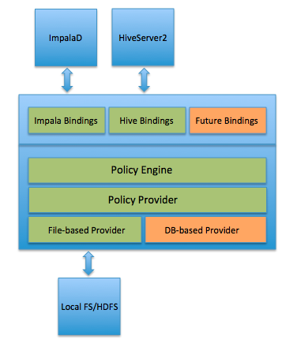
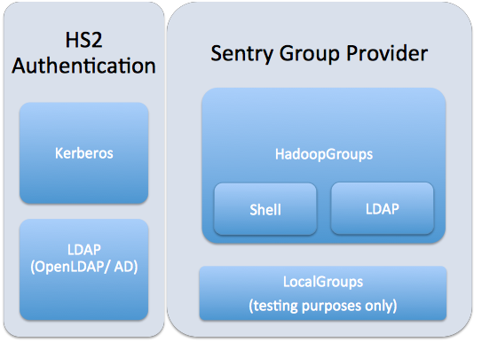

= CDH Security

* <<quick_basics_overview, Quick basics overview>>
* <<strong_authentication_kerberos, Strong Authentication: Kerberos>>
* <<fine_grained_authorization, Fine-grained Authorization>>
* <<hdfs_permissions, HDFS Permissions>>
* <<sentry, Apache Sentry>>
* <<in_flight_encryption, In-flight Encryption>>
* <<at_rest_encryption, At-rest encryption>>
* <<auditing, Auditing>>
* <<preparing_a_kerberos_configuration, Preparing a Kerberos Configuration>>
* <<potential_problems, Potential problems>>
* <<common_misconceptions, Common misconceptions>>
* <<security_labs_preparation, Security Labs Preparation>>
* <<lab_integrating_kerberos_with_cloudera_manager, Lab: Integrating Kerberos with Cloudera Manager>>
* <<sentry_lab, Sentry Lab>>
* <<double_bonus_security_lab_implement_tls_level_1_security, Double-bonus Security Lab: Implement TLS Level 1 Security>>

[[quick_basics_overview]]
== Quick basics overview

* **Perimeter**
** Strong authentication
** Network isolation, edge nodes
** Firewalls, iptables
* **Access**
** Authorization controls
** Granular access to HDFS files, Hive/Impala objects
* **Data**
** Encryption-at-rest
** Encryption-in-transit
*** Transport Layer Security (TLS)
* **Visibility**
** Auditing data practices without exposing content
** Separation of concerns: storage management vs. data stewardship

[[strong_authentication_kerberos]]
== Strong Authentication: Kerberos

* The Apache document link:http://hadoop.apache.org/docs/r2.6.0/hadoop-project-dist/hadoop-common/SecureMode.html["Hadoop in Secure Mode"] lists four needs for strong authentication:
** Hadoop users
** Hadoop services
** HTTP-based consoles
** Protecting data in-flight
* Linux supports link:http://web.mit.edu/kerberos/[MIT Kerberos] natively
* Kerberos is the only authentication model Hadoop supports
** In-transit encryption service hooks are available
** Browser authentication supported by link:http://en.wikipedia.org/wiki/SPNEGO[HTTP SPNEGO]
* LDAP/Active Directory integration is supported
** Applying existing user databases to Hadoop cluster is a common ask
* link:http://www.roguelynn.com/words/explain-like-im-5-kerberos/[ELI5: Kerberos]: Great introduction / refresher to Kerberos concepts.

=== Active Directory Integration

* Cloudera PS recommends Direct-to-AD integration as preferred practice.
* The alternative: a link:http://www.cloudera.com/documentation/enterprise/latest/topics/cdh_sg_hadoop_security_active_directory_integrate.html[one-way cross-realm trust to AD]
** Requires an MIT Kerberos implementation for the cluster
** Localizes creation of service principals and keytabs
* Common sticking points
** Administrator reluctance
** Version / feature incompatibility
** AD configurations that shouldn't be a problem

=== Common Direct-to-AD Issues

* Incorrect `/etc/krb5.conf` configuration
** Test with `kinit` before integrating
* Required encryption types aren't supported
** Again, make sure `/etc/krb5.conf` is right
** Verify Unlimited Encryption Strength is enabled
* To get debug information on the command line:
** `export KRB5_TRACE=/dev/stderr`
** `export HADOOP_OPTS="-Dsun.security.krb5.debug=true"`
** `export HADOOP_ROOT_LOGGER="DEBUG,console"`

[[fine_grained_authorization]]
== Fine-grained Authorization

* <<hdfs_permissions, HDFS permissions & ACLs>>
** File permissions for user-group-world may be too simple
** You must support a list of groups, not just one
* link:https://sentry.incubator.apache.org/[Apache Sentry (incubating)]
** Protects data objects (`server, database, table, URI`) that are projected onto file content
** Maps Linux/LDAP groups to roles that are configured with access privileges

[[hdfs_permissions]]
== link:http://hadoop.apache.org/docs/r2.6.0/hadoop-project-dist/hadoop-hdfs/HdfsPermissionsGuide.html[HDFS Permissions]

* HDFS permissions are mostly POSIX
** Remember that `hdfs` is the HDFS superuser, not `root`
** Execution bit on directories is a sticky bit
** Apply to Linux user or short-name Kerberos principal
* link:http://hadoop.apache.org/docs/r2.6.0/hadoop-project-dist/hadoop-hdfs/HdfsPermissionsGuide.html#ACLs_Access_Control_Lists[POSIX-style ACLs are supported]
** But disabled by default (`dfs.namenode.acls.enabled`)
** You can add permissions for users, groups, other, and apply a default _mask_
*** `chmod` operates on mask to calculate effective permissions
** ACLs are best used to refine -- not replace -- file permissions
*** There is a measurable cost to storing and processing them

[[sentry]]
== link:http://blog.cloudera.com/blog/2013/07/with-sentry-cloudera-fills-hadoops-enterprise-security-gap/[Apache Sentry]

* Originally a Cloudera project, now an link:http://sentry.apache.org/[Apache-governed project]
** Documentation not fully migrated to ASF
* Supports authorization for database objects
** Objects: server, database, table, view, URI
** Authorization privileges: `SELECT`, `INSERT`, `ALL`
* Sentry policies defines a role with privileges to an object
** Ex. `GRANT SELECT ON default.table_07 TO ROLE analyst;`
** You can then assign a group (LDAP or Linux) to that role
** `GRANT ROLE analyst to GROUP bi_team;`
** Add or remove users in the group at any time
* Sentry can be enforced for Hive, Impala and/or Search
** HiveServer2 is wired for Sentry
** Search has a legacy form of implementation
* Cloudera Manager has High Availability support for Sentry

=== Sentry Design

* Each service binds to a policy engine
** `impalad` and `HiveServer2` have separate hooks
* Initial Sentry behavior: all access is denied
** Rules are exceptions to default behavior
* link:https://www.cloudera.com/documentation/enterprise/latest/topics/sg_hdfs_sentry_sync.html[Sentry HDFS Synchronization]
** Automatically maps policies to HDFS ACLs

=== Sentry and link:http://www.cloudera.com/documentation/enterprise/latest/topics/cdh_ig_hiveserver2_configure.html[HiveServer2]

_Source: https://blogs.apache.org/sentry/_

=== link:http://www.cloudera.com/documentation/enterprise/latest/topics/cm_sg_sentry_service.html[The Sentry Service]

* Introduced in C5.1
* Uses database storage
* CDH had tools for migrating file-based authorizations to the database
** `sentry --command config-tool --policyIni *policy_file* --import`
* Impala & Hive can use the db or policy files
* Cloudera Search can only use policy files

[[in_flight_encryption]]
== In-flight Encryption

* How-to is link:http://blog.cloudera.com/blog/2013/03/how-to-set-up-a-hadoop-cluster-with-network-encryption/[documented here]
* Supports communication between web services (HTTPS)
* Uses `X.509` certificates for verifying server identity
* Can encrypt block data in transit, but it's expensive
** See `dfs.encrypt.data.transfer` property
* Support for RPC data out of the box
* Available support for:
** MR shuffling
** HTTP-based UIs
** NameNode data and `fsimage` transfers

[[at_rest_encryption]]
== At-rest encryption

* Must be transparent to Hadoop clients and services
** Requires creation of an _encryption zone_
** Each file is encrypted using a Data Encryption Key (DEK)
* HDFS Transparent Data Encryption
** Physically separating key storage and data storage offers maximum protection
** Imagine someone gets hold of a decommissioned DataNode
** Key Trustee (KTS) & Key Management Server (KMS) provide off-cluster storage
* Navigator Encrypt supports Linux volume or file encryption

[[auditing]]
== Auditing

* Provided by Cloudera Navigator
* Used to audit data access (filesystem, databases, log of queries run)
* Customizable reports for compliance checking
** Example: list all failed access attempts each month
* Supports redaction of sensitive fields

[[preparing_a_kerberos_configuration]]
== Preparing a Kerberos Configuration

* Know the link:http://www.cloudera.com/documentation/enterprise/latest/topics/cdh_ig_ports_cdh5.html[network ports that CDH and third-party software use]
* Set up a dedicated Kerberos Domain Controller
* KRB5 MIT link:http://web.mit.edu/Kerberos/krb5-1.8/krb5-1.8.6/doc/krb5-install.html#Realm-Configuration-Decisions[instructions are here]
* Cloudera link:https://www.cloudera.com/documentation/enterprise/latest/topics/cm_sg_intro_kerb.html[slightly higher-level instructions are here]
* Or you can use link:https://access.redhat.com/documentation/en-US/Red_Hat_Enterprise_Linux/6/html/Managing_Smart_Cards/installing-kerberos.html[RedHat's documentation]

[[potential_problems]]
== Potential problems

* Does your KDC allows *renewable tickets*?
** The default in Linux varies with the distribution. See link:https://access.redhat.com/documentation/en-US/Red_Hat_Enterprise_Linux/6/html/Deployment_Guide/Configuring_Domains-Setting_up_Kerberos_Authentication.html[RHEL docs].
** Add configuration for renewable tickets **before** you initialize the Kerberos database.
** If you do it after starting the database, you can hack it by:
**. Changing the `maxlife` for all principals using the `modprinc` command in `kadmin.local`, or
**. Trash your KDB and make a new one
* Your Cloudera Manager user (`cloudera-scm`) will need administrative privileges to generate a principal for each Hadoop service.

[[common_misconceptions]]
== Common misconceptions

* Your Kerberos realm name depends on your FQDN (it doesn't)
* Kerberos realm names are resolved by DNS (they aren't)
* The `/admin` suffix has admin privileges
** Only if you define them in `/var/kerberos/krb5kdc/kadm5.acl`

[[security_labs_preparation]]
== Security Labs Preparation

Before you start:

* Load sample data for Hive/Impala
** Login to HUE using your GitHub name and the password `cloudera`
** The first login to Hue becomes the admin account
* Follow the setup wizard to load sample tables for Hive and Impala
** You'll need this data to support the Sentry lab

[[lab_integrating_kerberos_with_cloudera_manager]]
== Lab: Integrating Kerberos with Cloudera Manager

* Follow the link:http://www.cloudera.com/documentation/enterprise/latest/topics/cm_sg_s4_kerb_wizard.html[documentation here]
** Use *Active Directory* (AD) integration
** Your instructor will provide the necessary information for the AD server
* Once integration is sucessful, add these files to `06-security/labs`:
** `/etc/krb5.conf` as `krb5.conf.adoc`
** `/var/kerberos/krb5kdc/kdc.conf` as `kfc.conf.adoc`
** `/var/kerberos/krb5kdc/kadm5.acl` as `kadm5.acl.adoc`
* Create a file `kinit.adoc` that includes:
** The `kinit` command you use to authenticate your test user
** The output from a `klist` command listing your credentials and ticket lifetime

[[sentry_lab]]
== Sentry Lab

* Install link:http://www.cloudera.com/documentation/enterprise/latest/topics/sg_sentry_service_config.html[Sentry as a Service]
* Follow this link:./sentry-tutorial.adoc[Sentry tutorial]
* Label the Issue `review` once you are finished
